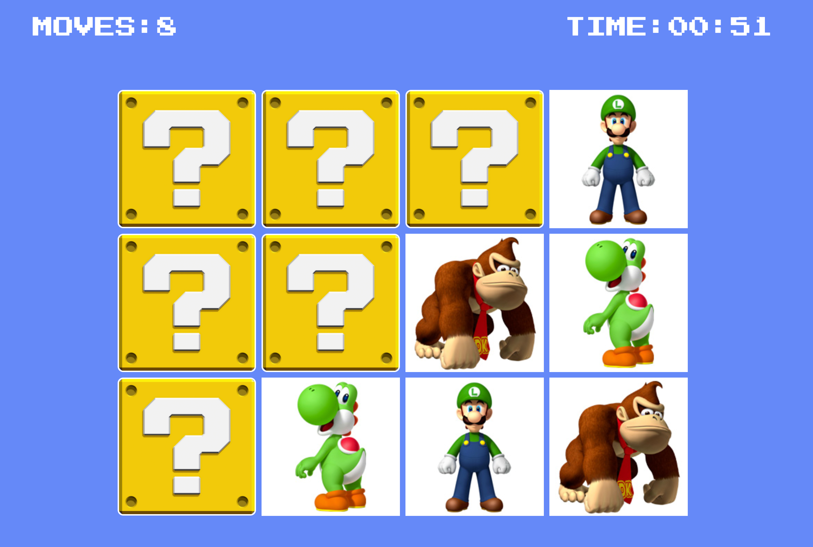

# Mario Memory Game W/ React/Tailwind

This project is designed to enhance my skills in various areas, including React components, React hooks, and Tailwind CSS. By building a matching cards game, the focus is on practical learning and hands-on experience with these technologies.

## Visual Overview

<a href="https://mario-memory-match.netlify.app/" target="_blank">LIVE DEMO</a>



## Technologies Used

- [React](https://reactjs.org/) - A JavaScript library for building user interfaces.
- [Tailwind CSS](https://tailwindcss.com/) - low-level CSS framework.

## Features

- **Card Matching:** Users can flip two cards at a time and check if they match. If the cards match, they stay face up; otherwise, they flip back down.

- **Timer:** The game includes a timer that keeps track of the time taken to complete the game.

- **Moves Counter:** A move counter displays the number of moves made by the user.

- **Win Condition:** When all the cards are successfully matched, a win message is displayed, along with the final time and number of moves.

- **Responsive Design:** Designed to be responsive and adaptable to different devices, ensuring an optimal user experience on desktops, tablets, and mobile devices.

## Installation

Follow these steps to set up the project on your local machine:

1. Clone the repository:

   ```shell
   git clone https://github.com/khalid-nur/mario-memory-match.git

   ```

2. Navigate to the project directory:

   ```shell
   cd mario-memory-match.git

   ```

3. Install the required dependencies:

   ```shell
   npm install
   ```

4. Run the app

   ```shell
   npm start
   ```

## Usage

Once the project is running, you can play the matching cards game by following these instructions:

1. Click start to launch the game.
2. Once, the game started click on any card to flip it and reveal the character.
3. Click on another card to flip it as well.
4. If the two cards match, they will remain face up.
5. If the cards do not match, they will flip back down.
6. Continue flipping cards and finding matching pairs until all cards are matched.
